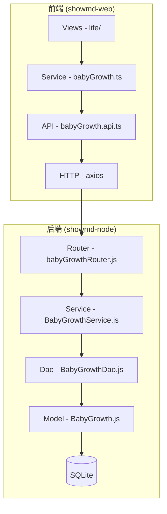
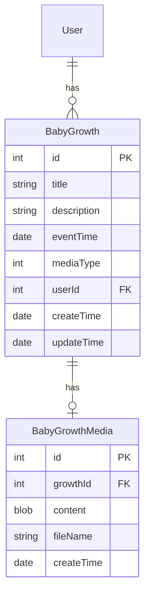

## 产品概述

宝宝成长记录功能模块，集成到 showmd 项目中，用于记录宝宝成长过程中的照片、视频、重要事件及其他相关内容。

## 核心功能

### 1. 成长记录管理

- 支持上传照片或视频文件
- 支持添加文字描述/想法/标题
- 支持记录事件发生时间
- 支持查看已发布的成长记录
- 支持编辑已发布的成长记录
- 支持删除成长记录

### 2. 时间线展示

- 按时间线（倒序）展示成长记录
- 展示缩略图、标题、描述摘要、时间
- 支持点击查看详情

### 3. 权限控制

- 登录用户可访问自己添加的内容
- 暂不支持分享功能
- 不支持多宝宝管理

## 用户故事

### US-01: 创建成长记录

作为登录用户，我想要上传宝宝的照片或视频并添加描述，以便记录宝宝的成长瞬间。

验收标准：

- Given 用户已登录且在成长记录页面
- When 用户点击"添加记录"，上传媒体文件并填写描述
- Then 系统保存记录并在时间线中显示

### US-02: 查看成长记录列表

作为登录用户，我想要按时间线查看我的所有成长记录，以便回顾宝宝的成长历程。

验收标准：

- Given 用户已登录且有成长记录数据
- When 用户进入成长记录页面
- Then 系统按时间倒序展示记录列表

### US-03: 编辑成长记录

作为登录用户，我想要编辑已发布的成长记录，以便修正信息或补充描述。

验收标准：

- Given 用户已登录且查看某条记录详情
- When 用户点击编辑并修改内容
- Then 系统保存修改并更新显示

### US-04: 删除成长记录

作为登录用户，我想要删除不需要的成长记录。

验收标准：

- Given 用户已登录且查看某条记录
- When 用户确认删除操作
- Then 系统删除该记录并刷新列表

## 技术栈

### 前端

- 框架：Vue 3 + TypeScript
- UI 组件：Element Plus
- 样式：Tailwind CSS + 自定义 CSS 变量
- 状态管理：Vuex
- 路由：Vue Router
- 日期处理：dayjs

### 后端

- 运行时：Node.js
- 框架：Express.js
- ORM：Sequelize
- 数据库：SQLite
- 文件上传：Multer
- 认证：JWT (已有实现)

## 实现方案

### 整体策略

复用现有项目的架构模式和代码结构，在 `src/views/life` 目录下新建成长记录页面，参考 Article 模块的实现模式（Model-Dao-Service-Router-API）完成后端 CRUD 功能。

### 关键技术决策

1. **媒体存储方案**：复用现有 Image 模块，将媒体文件以 BLOB 形式存储到数据库，与 Article 的图片上传机制一致

2. **路由设计**：在 Main.vue 的 children 路由下添加 life 相关路由，保持与 blog、tool 等模块一致的结构

3. **API 设计**：遵循 RESTful 风格，复用现有的 auth 中间件进行用户认证

4. **前端组件**：参考 Blog.vue 的时间线布局和 ArticleEdit.vue 的表单设计

## 实现细节

### 性能考虑

- 列表查询时排除媒体内容字段，只返回元数据
- 缩略图通过独立 API 获取，支持懒加载
- 视频采用原生上传，不做压缩处理（符合用户要求）

### 复用现有模式

- 继承 Dao 基类实现 CRUD
- 使用 Response 工具类统一响应格式
- 复用 auth 中间件进行登录鉴权
- 复用 ImageService 的文件上传逻辑

### 安全性

- 使用参数化查询防止 SQL 注入
- 通过 auth 中间件验证用户身份
- 查询时绑定 userId 确保数据隔离

## 架构设计

### 系统架构



### 数据模型



## 目录结构

### 前端文件

```
showmd-web/src/
├── api/
│   └── babyGrowth.api.ts      # [NEW] API 接口定义，定义成长记录相关的所有 API 路径
├── service/
│   └── babyGrowth.ts          # [NEW] 业务服务层，封装 API 调用，提供类型定义和数据转换
├── views/life/
│   ├── BabyGrowth.vue         # [NEW] 主页面组件，时间线布局展示成长记录列表
│   ├── BabyGrowthDetail.vue   # [NEW] 详情/编辑页面，支持查看、编辑、删除操作
│   └── components/
│       ├── GrowthTimeline.vue # [NEW] 时间线组件，负责时间线 UI 渲染
│       └── GrowthCard.vue     # [NEW] 记录卡片组件，展示单条记录缩略信息
├── router/
│   └── index.ts               # [MODIFY] 添加 /life/baby-growth 相关路由配置
└── api/
    └── index.ts               # [MODIFY] 导出新增的 babyGrowth API 模块
```

### 后端文件

```
showmd-node/src/
├── model/
│   ├── BabyGrowth.js          # [NEW] 成长记录数据模型，定义字段、关联关系
│   └── BabyGrowthMedia.js     # [NEW] 媒体文件数据模型，存储图片/视频二进制内容
├── dao/
│   ├── BabyGrowthDao.js       # [NEW] 数据访问层，实现记录的 CRUD 和查询方法
│   └── BabyGrowthMediaDao.js  # [NEW] 媒体文件数据访问层
├── service/
│   └── BabyGrowthService.js   # [NEW] 业务逻辑层，处理创建/更新/删除/查询逻辑
├── routes/
│   ├── babyGrowthRouter.js    # [NEW] 路由定义，定义 RESTful API 端点
│   └── index.js               # [MODIFY] 注册 babyGrowthRouter 到主路由
└── constant/
    └── index.js               # [MODIFY] 添加媒体类型常量定义
```

## 关键代码结构

### 数据模型接口

```typescript
// 成长记录接口定义
interface IBabyGrowth {
  id?: number;
  title: string;           // 标题
  description?: string;    // 描述内容
  eventTime: Date;         // 事件发生时间
  mediaType: number;       // 媒体类型: 1-图片, 2-视频
  userId: number;          // 用户ID
  createTime?: Date;
  updateTime?: Date;
}

// 媒体文件接口
interface IBabyGrowthMedia {
  id?: number;
  growthId: number;        // 关联的成长记录ID
  content: Blob;           // 媒体内容
  fileName: string;        // 文件名
  createTime?: Date;
}
```

### API 路由设计

```
POST   /showmd/baby-growth/create     # 创建成长记录
GET    /showmd/baby-growth/list       # 获取记录列表
GET    /showmd/baby-growth/:id        # 获取记录详情
PUT    /showmd/baby-growth/:id        # 更新记录
DELETE /showmd/baby-growth/:id        # 删除记录
GET    /showmd/baby-growth/media/:id  # 获取媒体文件
```

## 设计风格

采用现代简约风格，以温馨、柔和的视觉效果呈现宝宝成长记录。参考现有 Blog 页面的设计语言，使用玻璃拟态效果和渐变色彩，营造温暖、精致的氛围。

## 页面设计

### 1. 成长记录列表页 (BabyGrowth.vue)

**整体布局**：单栏居中布局，最大宽度 900px

**顶部区域**：

- 页面标题"宝宝成长记录"，配合温馨图标
- 右侧"添加记录"按钮，渐变背景，圆角设计

**时间线区域**：

- 垂直时间线布局，左侧时间轴线条
- 记录卡片交替排列，悬停时微上浮动效果
- 每张卡片包含：缩略图、标题、描述摘要、时间标签
- 卡片使用玻璃拟态效果，圆角边框

**空状态**：居中显示引导文案和添加按钮

### 2. 详情/编辑页 (BabyGrowthDetail.vue)

**布局**：居中卡片布局，最大宽度 800px

**查看模式**：

- 顶部展示媒体内容（图片/视频播放器）
- 下方展示标题、描述、事件时间
- 右上角编辑和删除图标按钮

**编辑模式**：

- 媒体上传区域，支持拖拽上传
- 标题输入框
- 描述文本域
- 事件时间日期选择器
- 底部保存/取消按钮组

### 3. 交互细节

- 列表卡片点击进入详情页
- 删除操作需二次确认弹窗
- 表单提交显示 loading 状态
- 操作成功/失败显示 toast 提示

## Skill 扩展

### brainstorming

- **用途**：在 Brainstorm 阶段进行需求探索和方案讨论
- **预期结果**：明确功能边界、用户场景和技术可行性

### writing-plans

- **用途**：在 Map/Architect 阶段制定详细实现计划
- **预期结果**：产出可执行的开发任务清单

### executing-plans

- **用途**：在 Develop 阶段按计划逐步实现功能
- **预期结果**：完成代码实现并通过验证

### verification-before-completion

- **用途**：在每个开发任务完成后进行验证
- **预期结果**：确保功能正确实现，无回归问题