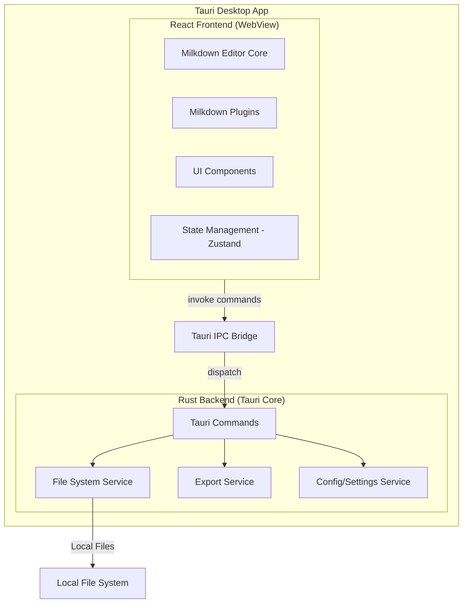
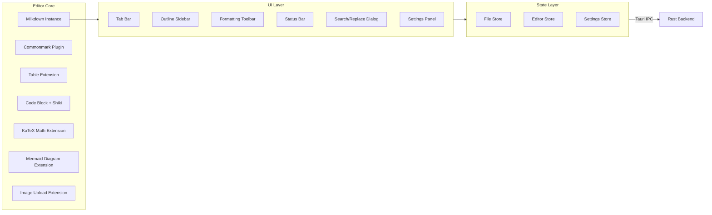

## Product Overview

MyTypora 是一款类 Typora 的本地 Markdown 编辑器桌面应用，采用所见即所得（WYSIWYG）的编辑体验。用户在编写 Markdown 时无需关注源码语法，直接看到最终渲染效果。项目定位为个人学习项目，打造一款自用的 Markdown 编辑器。

## Core Features

### MVP 核心能力（按优先级排列）

**P0 - 基础编辑能力**

- Markdown 实时 WYSIWYG 编辑与渲染（标题、粗体、斜体、删除线、引用、分割线）
- 列表编辑（有序列表、无序列表、任务列表/待办列表）
- 代码块编辑与语法高亮
- 图片插入与预览（支持本地图片拖拽、粘贴）
- 链接插入与编辑
- 表格创建与编辑（行/列增删）

**P0 - 文件管理**

- 打开/新建 Markdown 文件
- 保存文件（Ctrl+S）
- 多标签页管理（打开、关闭、切换）
- 文件最近打开记录

**P1 - 导出功能**

- 导出为 PDF
- 导出为 HTML

**P1 - 高级 Markdown 功能**

- 数学公式渲染（KaTeX/LaTeX 语法）
- Mermaid 图表渲染
- 自动生成目录（TOC）

**P2 - 增强体验**

- 主题切换（亮色/暗色）
- 快捷键自定义
- 字数/行数统计
- 搜索与替换（支持正则）
- 大纲视图（文件结构导航）

### 明确不做的事项（MVP 阶段）

- 不做云端同步与协作
- 不做插件系统（预留扩展接口）
- 不做移动端

## Tech Stack Selection

| 层次 | 技术选择 | 版本 | 说明 |
| --- | --- | --- | --- |
| 桌面框架 | Tauri | 2.x | Rust 后端 + Web 前端，包体小、性能好 |
| 后端语言 | Rust | edition 2021 | Tauri 核心，负责文件系统和系统调用 |
| 前端框架 | React | 18.x | 组件化开发，生态成熟 |
| 前端语言 | TypeScript | 5.x | 类型安全，IDE 支持好 |
| 富文本编辑器 | Milkdown | 7.x | 基于 ProseMirror + Remark，Markdown-first，完全开源 MIT |
| 前端样式 | Tailwind CSS | 3.x | 快速构建 UI |
| 数学公式 | KaTeX | 0.16+ | 轻量快速，通过 Milkdown 插件集成 |
| 图表渲染 | Mermaid | 10.x | 流程图/时序图等，通过自定义 Milkdown NodeView 集成 |
| 代码高亮 | Shiki | 1.x | VS Code 同款高亮引擎，主题丰富 |
| PDF 导出 | Rust: headless_chrome 或 print-to-pdf | - | 利用 Tauri 内置 WebView 的打印能力 |
| 包管理 | pnpm | 9.x | 前端依赖管理 |
| 构建工具 | Vite | 5.x | 快速 HMR，与 Tauri 2.x 深度集成 |


## Implementation Approach

### 整体策略

采用 **Tauri 2.x + React + Milkdown** 的技术组合。Tauri 负责 Rust 后端（文件系统操作、PDF 导出）和窗口管理，React + Milkdown 负责 WYSIWYG 编辑器前端。前后端通过 Tauri IPC Commands 通信。

### 关键技术决策

**1. 编辑器选型：Milkdown vs TipTap vs ProseMirror vs CodeMirror**

- 选择 **Milkdown v7**（基于 ProseMirror + Remark）。Milkdown 是 Markdown-first 的插件驱动型 WYSIWYG 编辑框架，灵感直接来自 Typora。相比 TipTap（富文本优先，需额外扩展支持 Markdown），Milkdown 内置基于 Remark AST 的 Markdown 双向同步，无需额外适配。完全 MIT 开源无付费陷阱。支持内置斜杠命令（`@milkdown/plugin-slash`）、监听器（`@milkdown/plugin-listener`）等开箱即用插件。CodeMirror 偏向代码编辑，不适合 WYSIWYG 场景。

**2. Markdown 双向同步**

- Milkdown 基于 Remark AST 构建，Markdown 文本与编辑器状态的双向同步是原生内置能力，无需额外扩展。通过 `@milkdown/kit` 的 `editor.view()` 获取 Markdown 源码，自定义插件（KaTeX、Mermaid、增强代码块）通过 Remark 的 `transformer` 管道实现序列化/反序列化。

**3. PDF 导出方案**

- 优先使用 Tauri WebView 的 `webview.print()` 能力，通过 CSS `@media print` 控制打印样式，调用系统原生打印对话框选择"另存为 PDF"。跨平台兼容性好，无需额外依赖。备选方案：Rust 侧使用 `headless_chrome` crate。

**4. Tauri 2.x 架构**

- Tauri 2.x 相比 1.x 采用全新的插件系统。核心功能通过 Tauri Commands 实现：`read_file`、`write_file`、`export_pdf`、`get_recent_files` 等。

### 性能与可靠性

- **编辑性能**：Milkdown/ProseMirror 采用不可变数据结构，编辑操作 O(log n) 复杂度，大文档（10000+ 行）无明显卡顿
- **大文件处理**：对超过 5MB 的文件显示警告，采用虚拟滚动优化渲染
- **Mermaid 渲染**：采用 Web Worker 异步渲染，避免阻塞主线程；对 Mermaid 块做 debounce 处理
- **自动保存**：采用 debounce 策略（停止输入 1 秒后触发），避免频繁 I/O

## Architecture Design

### 系统架构



### 前端模块架构



## Directory Structure

```
myTypora/
├── src-tauri/                          # [NEW] Tauri/Rust 后端
│   ├── Cargo.toml                      # [NEW] Rust 依赖配置
│   ├── tauri.conf.json                 # [NEW] Tauri 应用配置（窗口大小、图标等）
│   ├── capabilities/                   # [NEW] Tauri 2.x 权限声明
│   │   └── default.json               # [NEW] 默认权限（文件读写、对话框等）
│   └── src/
│       ├── main.rs                     # [NEW] Tauri 入口，注册命令和插件
│       ├── lib.rs                      # [NEW] 模块声明与导出
│       ├── commands/                   # [NEW] Tauri IPC 命令定义
│       │   ├── mod.rs                  # [NEW] 模块导出
│       │   ├── file_commands.rs        # [NEW] 文件操作命令（打开、保存、新建）
│       │   ├── export_commands.rs      # [NEW] 导出命令（PDF、HTML）
│       │   └── config_commands.rs      # [NEW] 配置命令（读取/保存设置、最近文件）
│       ├── services/                   # [NEW] 业务逻辑层
│       │   ├── mod.rs                  # [NEW] 模块导出
│       │   ├── file_service.rs         # [NEW] 文件系统操作封装
│       │   ├── export_service.rs       # [NEW] PDF/HTML 导出实现
│       │   └── config_service.rs       # [NEW] 配置管理（JSON 文件存储）
│       └── models/                     # [NEW] 数据模型
│           ├── mod.rs                  # [NEW] 模块导出
│           ├── file_metadata.rs        # [NEW] 文件元数据结构体
│           └── app_config.rs           # [NEW] 应用配置结构体
│
├── src/                                # [NEW] React 前端
│   ├── main.tsx                        # [NEW] React 入口
│   ├── App.tsx                         # [NEW] 根组件（路由/布局）
│   ├── components/                     # [NEW] UI 组件
│   │   ├── layout/                     # [NEW] 布局组件
│   │   │   ├── TitleBar.tsx            # [NEW] 自定义标题栏（macOS 风格）
│   │   │   ├── TabBar.tsx              # [NEW] 标签页管理组件
│   │   │   ├── Sidebar.tsx             # [NEW] 侧边栏（大纲/文件树）
│   │   │   ├── StatusBar.tsx           # [NEW] 状态栏（字数统计、语言等）
│   │   │   └── MainLayout.tsx          # [NEW] 主布局容器
│   │   ├── editor/                     # [NEW] 编辑器组件
│   │   │   ├── Editor.tsx              # [NEW] Milkdown 编辑器主组件
│   │   │   ├── EditorToolbar.tsx       # [NEW] 格式工具栏
│   │   │   ├── BubbleMenu.tsx          # [NEW] 选中文字悬浮菜单
│   │   │   ├── SlashCommand.tsx        # [NEW] 斜杠命令面板
│   │   │   └── SearchReplace.tsx       # [NEW] 搜索替换对话框
│   │   └── settings/                   # [NEW] 设置相关组件
│   │       ├── SettingsDialog.tsx      # [NEW] 设置弹窗
│   │       ├── ThemeSettings.tsx       # [NEW] 主题设置
│   │       └── ShortcutSettings.tsx    # [NEW] 快捷键设置
│   ├── extensions/                     # [NEW] Milkdown 自定义插件
│   │   ├── math-plugin.ts              # [NEW] KaTeX 数学公式 NodeView 插件
│   │   ├── mermaid-plugin.ts           # [NEW] Mermaid 图表 NodeView 插件
│   │   ├── code-block-plugin.ts        # [NEW] 增强代码块（Shiki 高亮 + 语言选择）
│   │   ├── image-plugin.ts             # [NEW] 图片增强（拖拽/粘贴/调整大小）
│   │   └── editor-setup.ts             # [NEW] Milkdown 编辑器初始化与插件组合配置
│   ├── hooks/                          # [NEW] 自定义 Hooks
│   │   ├── useEditor.ts                # [NEW] Milkdown 编辑器实例 Hook
│   │   ├── useFile.ts                  # [NEW] 文件操作 Hook（打开/保存/自动保存）
│   │   ├── useTabs.ts                  # [NEW] 标签页管理 Hook
│   │   ├── useTheme.ts                 # [NEW] 主题切换 Hook
│   │   └── useShortcuts.ts             # [NEW] 全局快捷键 Hook
│   ├── stores/                         # [NEW] 状态管理（Zustand）
│   │   ├── file-store.ts               # [NEW] 文件状态（打开的文件列表、当前活跃文件）
│   │   ├── editor-store.ts             # [NEW] 编辑器状态（内容、修改标记等）
│   │   └── settings-store.ts           # [NEW] 应用设置状态（主题、快捷键等）
│   ├── services/                       # [NEW] Tauri IPC 调用封装
│   │   ├── file-service.ts             # [NEW] 文件系统 IPC 调用
│   │   ├── export-service.ts           # [NEW] 导出 IPC 调用
│   │   └── config-service.ts           # [NEW] 配置 IPC 调用
│   ├── types/                          # [NEW] TypeScript 类型定义
│   │   ├── file.ts                     # [NEW] 文件相关类型
│   │   ├── editor.ts                   # [NEW] 编辑器相关类型
│   │   └── settings.ts                 # [NEW] 设置相关类型
│   ├── utils/                          # [NEW] 工具函数
│   │   ├── markdown.ts                 # [NEW] Markdown 处理工具
│   │   ├── toc.ts                      # [NEW] 目录生成工具
│   │   └── platform.ts                 # [NEW] 平台适配工具（macOS/Windows/Linux）
│   └── styles/                         # [NEW] 样式文件
│       ├── editor.css                  # [NEW] 编辑器内容样式（Typora 风格）
│       ├── print.css                   # [NEW] PDF 导出打印样式
│       └── themes/                     # [NEW] 主题文件
│           ├── light.css               # [NEW] 亮色主题
│           └── dark.css                # [NEW] 暗色主题
│
├── package.json                        # [NEW] 前端依赖配置
├── pnpm-lock.yaml                      # [NEW] 锁文件
├── tsconfig.json                       # [NEW] TypeScript 配置
├── vite.config.ts                      # [NEW] Vite 配置（含 Tauri 插件）
├── tailwind.config.js                  # [NEW] Tailwind CSS 配置
├── .gitignore                          # [NEW] Git 忽略规则
└── README.md                           # [NEW] 项目说明文档
```

## Implementation Notes

### Tauri 2.x 注意事项

- Tauri 2.x 使用 `@tauri-apps/api` 的 `invoke()` 函数进行 IPC 调用，与 Tauri 1.x 的 `tauri::command` 宏兼容但权限系统独立
- 文件操作需在 `capabilities/default.json` 中声明 `fs:allow-read`、`fs:allow-write` 等权限
- 对话框（打开/保存文件）需声明 `dialog:allow-open`、`dialog:allow-save` 权限

### Milkdown + Markdown 关键路径

- Milkdown 基于 Remark AST 原生支持 Markdown 双向同步，通过 `editor.action((ctx) => ctx.get(editorViewCtxAttr))` 获取编辑器状态，`editor.action(markdown())` 获取/设置 Markdown 源码
- 自定义插件（KaTeX、Mermaid、增强代码块）通过 Milkdown 的 `$prose` 和 `$inputRule` 系统实现，使用 Remark 的 `transformer` 管道处理序列化/反序列化
- Mermaid 图表使用自定义 ProseMirror NodeView，在 `update()` 生命周期中异步渲染到 DOM，避免阻塞编辑
- 核心插件组合：`@milkdown/kit`（基础能力）+ `@milkdown/plugin-slash`（斜杠命令）+ `@milkdown/plugin-upload`（图片上传）+ `@milkdown/plugin-tooltip`（浮动提示）+ 自定义插件

### 自动保存与文件变更检测

- 自动保存 debounce 1 秒，通过 Rust 侧的 `file_service` 写入
- 使用 Tauri 的 `fs.watch()` 监听外部文件变更，提示用户重新加载

### 跨平台 UI 适配

- macOS：窗口支持 `titleBarStyle: "overlay"` 实现交通灯按钮与标题栏融合
- Windows/Linux：使用自定义标题栏，窗口按钮（最小化/最大化/关闭）内嵌
- 快捷键差异：macOS 用 `Cmd`，Windows/Linux 用 `Ctrl`，通过 `platform.ts` 工具函数统一处理

## Design Style

采用 **现代极简主义** 风格，致敬 Typora 的沉浸式写作体验。整体视觉追求简洁、优雅、低干扰，让用户专注于内容创作。使用 React + TypeScript + Tailwind CSS + shadcn/ui 构建。

## Page Planning

### Page 1: 主编辑界面（核心页面）

编辑器的核心布局，参考 Typora 的沉浸式体验设计。

**Block 1 - 自定义标题栏**
macOS 风格的交通灯按钮区域，居中显示文件名和修改状态（已保存/未保存），右侧放置设置图标。支持拖拽移动窗口。

**Block 2 - 多标签栏**
水平标签栏展示已打开的文件，每个标签显示文件名和关闭按钮。当前活跃标签高亮。支持鼠标中键关闭标签。支持标签拖拽排序。

**Block 3 - 侧边栏（可折叠）**
左侧侧边栏，包含两个面板：大纲面板（TOC，按标题层级展示文档结构，点击跳转）和搜索面板（全局搜索/替换，支持正则表达式）。侧边栏可通过快捷键或按钮切换显示/隐藏。

**Block 4 - 编辑器主区域（核心）**
占据主要空间的 WYSIWYG 编辑区域。Milkdown 编辑器提供沉浸式写作体验，无干扰边框。选中文字时显示浮动格式菜单（粗体/斜体/链接/代码等），输入 "/" 触发内置斜杠命令面板。编辑器内容居中显示，最大宽度 800px，两侧留白。支持所有 Markdown 语法的所见即所得渲染。

**Block 5 - 状态栏**
底部状态栏，左侧显示字数统计、行数、光标位置，中间显示当前文件类型，右侧显示主题切换按钮。

### Page 2: 设置弹窗（模态窗口）

应用设置界面，使用 Dialog 组件实现。

**Block 1 - 设置导航**
左侧垂直导航，包含通用设置、外观设置、编辑器设置、快捷键设置四个分类。

**Block 2 - 通用设置面板**
包含默认文件编码（UTF-8）、自动保存间隔、最近文件列表数量、语言选择等配置项。

**Block 3 - 外观设置面板**
主题选择（亮色/暗色/跟随系统），字体设置（编辑字体和字号），编辑区域最大宽度调整。

**Block 4 - 快捷键设置面板**
以表格形式展示所有快捷键映射，支持自定义修改。分类展示：文件操作、编辑操作、格式操作、视图操作。

### Page 3: 搜索替换面板（内嵌侧边栏或浮动面板）

全局搜索与替换功能界面。

**Block 1 - 搜索输入区**
搜索输入框，支持正则表达式切换、大小写敏感切换、全词匹配切换。显示匹配结果计数和上下一个导航按钮。

**Block 2 - 替换操作区**
替换输入框和替换/全部替换按钮。替换操作有撤销确认机制。

**Block 3 - 搜索结果列表**
显示匹配位置和上下文预览，点击可跳转到对应位置。

## Agent Extensions

### SubAgent

- **bmad-analyst**
- Purpose: 在 Brainstorm 阶段进行业务分析、竞品分析、市场调研
- Expected outcome: 产出需求概要文档和竞品分析报告

- **bmad-product-manager**
- Purpose: 在 Map 阶段编写 PRD、用户故事和验收标准
- Expected outcome: 产出产品需求文档和用户故事列表

- **bmad-product-owner**
- Purpose: 在 Map 阶段管理产品待办列表、确定优先级（MoSCoW/RICE）
- Expected outcome: 产出产品 Backlog 和优先级排序

- **bmad-ux-expert**
- Purpose: 在 Map 阶段进行用户体验设计、交互设计和界面设计规范
- Expected outcome: 产出用户画像、信息架构和交互设计规范

- **bmad-architect**
- Purpose: 在 Architect 阶段设计系统架构、技术选型和接口定义
- Expected outcome: 产出架构设计文档和 ADR

- **bmad-developer**
- Purpose: 在 Develop 阶段实现功能代码
- Expected outcome: 产出可运行的高质量代码

- **bmad-qa**
- Purpose: 在 Develop 阶段制定测试策略和测试用例
- Expected outcome: 产出测试用例和测试报告

- **bmad-code-reviewer**
- Purpose: 在 Develop 阶段进行代码审查
- Expected outcome: 产出代码审查报告和改进建议

- **bmad-scrum-master**
- Purpose: 在 Develop 阶段管理 Sprint 规划和进度跟踪
- Expected outcome: 产出 Sprint 计划和进度报告