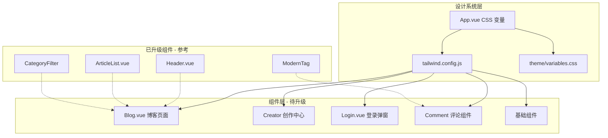

## 产品概述

使用 BMAD 方法论对 showmd-web 个人博客系统进行 UI 现代化重构，打造更美观、年轻化的用户界面，提升交互体验和动画效果，同时保持现有技术架构的稳定性。

## 核心特性

1. **博客列表页升级** - 重新设计 Blog.vue 页面布局，采用现代化卡片设计、动态排序筛选、侧边栏热门文章展示升级
2. **创作中心现代化** - 升级 Creator 相关组件（Sider.vue、Article.vue），实现毛玻璃侧边栏、现代化文章管理表格
3. **登录弹窗重设计** - 现代化 Login.vue，添加渐变背景、毛玻璃效果、流畅动画
4. **评论系统美化** - 升级 Comment 组件群，实现气泡对话式评论、渐变头像、互动动画
5. **基础组件增强** - 优化 Avatar、Loading、Empty 等基础组件，统一设计语言
6. **Tailwind 配置扩展** - 扩展 tailwind.config.js，集成年轻化色彩系统和动效配置

## 技术栈

- **框架**: Vue 3.2.25 + TypeScript + Vite 2.9.5
- **UI 组件库**: Element Plus 2.2.15（渐进式覆盖样式）
- **样式方案**: TailwindCSS 3.0.24 + WindiCSS 3.5.6 + CSS 变量
- **动画库**: GSAP 3.12.2 + Animate.css 4.1.1（已有，充分利用）
- **状态管理**: Vuex 4.0.2

## 实现方案

### 整体策略

采用 BMAD（Build-Measure-Analyze-Develop）方法论，渐进式升级 UI 组件：

1. **复用已有设计系统** - 项目已在 App.vue 定义了完整的年轻化 CSS 变量（渐变色、霓虹色、毛玻璃效果、动效变量），直接复用
2. **组件级渐进升级** - 每个组件独立升级，保持向后兼容
3. **统一设计语言** - 基于已有 ModernTag、CategoryFilter、ArticleList 的设计模式进行扩展

### 关键技术决策

1. **扩展 Tailwind 配置** - 将 App.vue 中的 CSS 变量映射到 Tailwind utilities，便于组件开发
2. **毛玻璃效果标准化** - 使用 `backdrop-filter: blur()` + 透明背景，暗色主题自适应
3. **动画统一化** - 使用 CSS 变量定义的 `--transition-smooth` 和 `--transition-bounce` 实现一致的动效体验
4. **渐变边框技术** - 使用伪元素叠加实现渐变边框效果（参考 ArticleList.vue 实现）

## 实现注意事项

### 性能考量

- 毛玻璃效果（backdrop-filter）在移动端可能影响性能，需要添加 `will-change: transform` 优化
- 动画使用 CSS transform 而非 top/left，避免重排
- 渐变背景使用 `background-size: 200% 200%` + `animation` 实现流动效果，而非 JS 动画

### 复用现有模式

- 参考 Header.vue 的毛玻璃导航实现
- 参考 ArticleList.vue 的卡片悬浮动画
- 参考 ModernTag 的彩虹色系统
- 参考 CategoryFilter 的 pills/cards/minimal 多变体模式

### 暗色主题适配

- 所有新组件必须支持 `.dark` 类切换
- 使用已定义的 `--showmd-*` 变量系统
- 毛玻璃效果在暗色主题下使用 `rgba(0, 0, 0, 0.3)` 背景

## 架构设计

### 系统架构图



### 数据流

用户交互 -> Vue 组件响应 -> CSS 变量/Tailwind 类切换 -> 浏览器渲染动画

## 目录结构

```
showmd-web/
├── tailwind.config.js           # [MODIFY] 扩展年轻化色彩系统、动效配置、毛玻璃 utilities
├── src/
│   ├── App.vue                  # [MODIFY] 补充全局样式，添加更多 Element Plus 组件覆盖样式（Input、Dialog、Menu）
│   ├── theme/
│   │   └── modern.css           # [NEW] 现代化通用样式类库，提取可复用的毛玻璃、渐变、动画样式
│   ├── views/
│   │   ├── blog/
│   │   │   ├── Blog.vue         # [MODIFY] 升级页面布局，添加毛玻璃分类导航、现代化侧边栏
│   │   │   └── Top.vue          # [MODIFY] 升级热门文章卡片，添加排名渐变、悬浮动画
│   │   ├── creator/
│   │   │   ├── Creator.vue      # [MODIFY] 升级创作中心布局，添加毛玻璃侧边栏效果
│   │   │   ├── Sider.vue        # [MODIFY] 升级侧边导航，添加渐变选中态、图标动画、毛玻璃效果
│   │   │   └── manage/
│   │   │       └── Article.vue  # [MODIFY] 升级文章管理表格，添加现代化卡片列表、操作按钮动画
│   │   └── main/
│   │       ├── Login.vue        # [MODIFY] 重设计登录弹窗，添加渐变背景、毛玻璃卡片、表单动画
│   │       └── UserOprate.vue   # [MODIFY] 升级用户操作下拉菜单，添加毛玻璃效果、平滑动画
│   └── components/
│       ├── Avatar.vue           # [MODIFY] 升级头像组件，添加渐变边框、在线状态指示、悬浮效果
│       ├── Loading.vue          # [MODIFY] 升级加载组件，添加现代化 skeleton 动画、渐变效果
│       ├── Empty.vue            # [MODIFY] 升级空状态组件，添加动态插图、引导按钮
│       └── Comment/
│           ├── Comment.vue      # [MODIFY] 升级评论容器，添加渐变标题、动画计数
│           ├── Item.vue         # [MODIFY] 升级评论条目，添加气泡卡片、互动动画、渐变头像
│           └── AddItem.vue      # [MODIFY] 升级评论输入框，添加毛玻璃效果、焦点动画
```

## 关键代码结构

### Tailwind 配置扩展接口

```typescript
// tailwind.config.js 扩展类型定义
interface TailwindExtension {
  colors: {
    vibrant: { purple: string; blue: string; orange: string; green: string; pink: string };
    neon: { blue: string; pink: string; green: string; purple: string; orange: string };
  };
  backgroundImage: {
    'gradient-primary': string;
    'gradient-secondary': string;
    'gradient-accent': string;
    'gradient-warm': string;
    'gradient-cool': string;
  };
  animation: {
    'float': string;
    'glow': string;
    'shimmer': string;
    'pulse-slow': string;
  };
  backdropBlur: {
    glass: string;
  };
}
```

### 现代化组件 Props 接口

```typescript
// 通用现代化组件 Props 模式
interface ModernComponentProps {
  variant?: 'glass' | 'solid' | 'gradient' | 'outlined';
  size?: 'small' | 'medium' | 'large';
  animated?: boolean;
  glowOnHover?: boolean;
}
```