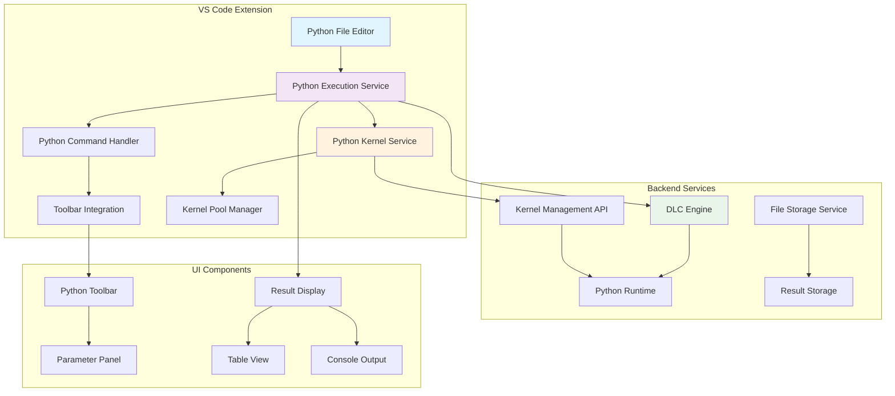

## 用户需求

**原始需求**：
基于 TAPD 需求单 https://tapd.woa.com/tapd_fe/20419031/story/detail/1020419031130113123，为 WeData Studio 提供 Python 文件运行和调试能力。

**产品概述**：
WeData Studio 是一个基于 VS Code 的云端数据开发环境，目前支持 SQL 文件和 Jupyter Notebook 的运行。本需求要求扩展其功能，支持 .py 文件的直接运行和调试，为数据工程师提供更完整的 Python 开发体验。

**核心功能**：

1. **Python 文件运行链路**：支持 .py 文件的提交、运行和结果展示，与现有 SQL 文件运行体验保持一致
2. **辅助功能集成**：在 .py 文件中支持 dlcutils、魔法命令、display() 表格化展示等数据科学辅助功能
3. **独立 Kernel 管理**：每次运行创建新的 Kernel 实例，确保运行环境的独立性和一致性
4. **Kernel 生命周期管理**：提供新建和释放 Kernel 的接口，支持资源的有效管理
5. **用户界面集成**：为 Python 文件提供与 SQL 文件类似的工具栏、参数面板和结果展示界面

**技术约束**：

- 依赖 DLC 引擎提供计算能力
- 需要与现有 Notebook 架构保持兼容
- Python 文件运行本质上是单单元格（single-cell）的 Notebook 执行模式
- 需要支持环境变量配置、容器镜像配置等现有环境管理功能

## 技术栈选型

**现有技术栈**：

- **前端框架**：TypeScript + React + VS Code Extension API
- **UI 组件库**：TDesign React + Tea Component
- **状态管理**：VS Code GlobalState + 自定义 GlobalStore
- **网络通信**：基于 httpBridge 的 RPC 调用
- **文件系统**：VS Code FileSystemProvider + WeData Notebook 协议

**新增技术组件**：

- **Kernel 管理**：复用现有 Jupyter Kernel 管理机制
- **Python 执行**：基于 DLC 引擎的 Python 运行时
- **结果展示**：复用现有 sqlTable webview 组件

## 实施方案

### 核心策略

采用**渐进式扩展**策略，在现有 SQL 文件运行架构基础上，为 Python 文件提供类似的运行体验。通过复用现有的 Kernel 管理、参数配置、结果展示等组件，最小化开发成本并保持架构一致性。

### 关键技术决策

1. **架构复用决策**：

- **理由**：现有 SQL 执行服务（SqlExecutionService）已经实现了完整的文件运行流程，包括参数管理、工具栏集成、结果展示等
- **方案**：创建 PythonExecutionService，继承 SQL 执行服务的核心模式，但适配 Python 特有的 Kernel 管理需求

2. **Kernel 管理策略**：

- **理由**：需求明确要求每次运行新建 Kernel 以保证独立性
- **方案**：实现 PythonKernelService，封装 Kernel 的创建、执行、销毁生命周期，与现有 Jupyter 扩展集成

3. **UI 集成方案**：

- **理由**：用户期望 Python 文件具有与 SQL 文件一致的操作体验
- **方案**：扩展现有工具栏系统，为 .py 文件添加专用的运行、停止、参数配置等按钮

### 实施细节

**性能优化**：

- **Kernel 缓存**：实现 Kernel 池机制，避免频繁创建销毁的开销
- **结果流式传输**：大数据量结果采用分批传输，避免内存溢出
- **异步执行**：所有 Python 代码执行采用异步模式，避免阻塞 UI

**错误处理**：

- **Kernel 异常恢复**：Kernel 崩溃时自动重建，保证服务可用性
- **执行超时控制**：设置合理的执行超时时间，避免长时间占用资源
- **用户友好提示**：Python 语法错误、运行时异常等提供清晰的错误信息

**资源管理**：

- **内存监控**：监控 Kernel 内存使用，超限时主动释放
- **并发控制**：限制同时运行的 Python 任务数量，避免资源竞争
- **清理机制**：定期清理僵尸 Kernel，释放系统资源

## 架构设计

### 系统架构



### 模块划分

**1. Python 执行服务层**

- `PythonExecutionService`：核心执行逻辑，管理 Python 代码的提交和执行
- `PythonKernelService`：Kernel 生命周期管理，包括创建、监控、销毁
- `PythonParameterService`：参数解析和注入，支持魔法命令和变量替换

**2. 命令处理层**

- `PythonCommandHandler`：处理 Python 相关的 VS Code 命令
- `PythonToolbarIntegration`：工具栏按钮的注册和事件处理
- `PythonFileTypeHandler`：.py 文件类型的识别和处理

**3. UI 集成层**

- `PythonToolbarProvider`：提供 Python 文件专用的工具栏组件
- `PythonResultViewer`：结果展示组件，支持表格、图表、文本等多种格式
- `PythonParameterPanel`：参数配置面板，支持环境变量和运行参数设置

## 目录结构

### 新增文件结构

```
src/
├── python/                          # [NEW] Python 模块根目录
│   ├── index.ts                     # [NEW] Python 模块入口文件。负责模块的激活和停用，注册 Python 相关的命令和服务，初始化 Python 执行环境。集成点包括工具栏注册、文件类型监听、服务初始化。
│   ├── commands/                    # [NEW] Python 命令处理目录
│   │   ├── pythonCommands.ts        # [NEW] Python 命令注册和处理。实现 Python 文件的运行、停止、参数配置等命令，处理工具栏按钮点击事件，管理命令的启用/禁用状态。
│   │   └── toolbarCommands.ts       # [NEW] 工具栏集成命令。专门处理 Python 工具栏的按钮交互，包括运行按钮、停止按钮、参数按钮等的点击处理逻辑。
│   ├── services/                    # [NEW] Python 服务层目录
│   │   ├── pythonExecutionService.ts # [NEW] Python 执行服务核心类。管理 Python 代码的执行流程，包括代码预处理、参数注入、结果处理。实现与 DLC 引擎的通信，处理执行状态的轮询和更新。
│   │   ├── pythonKernelService.ts   # [NEW] Python Kernel 管理服务。负责 Kernel 的创建、销毁、监控，实现 Kernel 池管理，处理 Kernel 异常恢复，提供 Kernel 状态查询接口。
│   │   └── pythonParameterService.ts # [NEW] Python 参数管理服务。处理 Python 代码中的参数解析和替换，支持魔法命令的识别和处理，管理环境变量和运行时参数。
│   ├── types/                       # [NEW] Python 模块类型定义
│   │   └── index.ts                 # [NEW] Python 相关的 TypeScript 类型定义。包括 Kernel 信息接口、执行参数接口、执行结果接口、错误类型定义等。
│   └── utils/                       # [NEW] Python 工具函数目录
│       ├── kernelUtils.ts           # [NEW] Kernel 相关工具函数。提供 Kernel ID 生成、状态检查、异常处理等工具方法，封装与 Jupyter 扩展的交互逻辑。
│       └── codeProcessor.ts         # [NEW] Python 代码处理工具。实现代码的预处理、参数替换、魔法命令解析等功能，支持 dlcutils 和 display() 函数的注入。
├── command/
│   └── command.ts                   # [MODIFY] 扩展现有命令处理。添加 Python 文件相关的命令处理逻辑，包括新建 Python 文件、打开 Python 文件等基础操作的支持。
├── constants/
│   └── index.ts                     # [MODIFY] 添加 Python 相关常量。定义 Python 文件扩展名、Kernel 类型、执行状态等常量，补充现有常量定义。
└── types/
    └── index.ts                     # [MODIFY] 扩展类型定义。添加 Python 文件类型枚举、Python 执行相关的接口定义，扩展现有的文件类型系统。
```

### 配置文件修改

```
package.json                         # [MODIFY] 扩展配置文件。添加 Python 相关的命令定义、工具栏按钮配置、文件关联设置。包括 wedata.python.runFile、wedata.python.stopExecution 等命令的注册。
```

## 关键代码结构

### Python 执行服务接口

```typescript
interface IPythonExecutionService {
  // 执行 Python 文件
  executeFile(filePath: string, params?: PythonExecutionParams): Promise<PythonExecutionResult>;
  
  // 停止执行
  stopExecution(executionId: string): Promise<boolean>;
  
  // 获取执行状态
  getExecutionStatus(executionId: string): Promise<PythonExecutionStatus>;
}

interface PythonExecutionParams {
  kernelId?: string;
  environmentVars?: Record<string, string>;
  customParams?: Record<string, any>;
  timeout?: number;
}

interface PythonExecutionResult {
  success: boolean;
  executionId: string;
  output?: string;
  error?: string;
  displayData?: any[];
}
```

### Kernel 管理服务接口

```typescript
interface IPythonKernelService {
  // 创建新的 Kernel
  createKernel(config?: KernelConfig): Promise<string>;
  
  // 销毁 Kernel
  destroyKernel(kernelId: string): Promise<boolean>;
  
  // 获取 Kernel 状态
  getKernelStatus(kernelId: string): Promise<KernelStatus>;
  
  // 执行代码
  executeCode(kernelId: string, code: string): Promise<ExecutionResult>;
}

interface KernelConfig {
  environmentType: 'default' | 'custom';
  packageConfigFileId?: string;
  customEnvs?: Array<{ name: string; value: string }>;
}
```

## Agent Extensions

### Skill

- **brainstorming**
- 目的：在开始实施前进行需求分析和方案探讨
- 预期结果：明确 Python 文件运行的具体需求和技术方案细节

- **writing-plans**
- 目的：将 BMAD 方法论的分析结果转化为详细的实施计划
- 预期结果：产出结构化的开发任务列表和实施步骤

- **executing-plans**
- 目的：按照制定的计划逐步执行开发任务
- 预期结果：完成 Python 文件运行功能的开发和集成

- **test-driven-development**
- 目的：为 Python 执行服务编写测试用例，确保功能正确性
- 预期结果：完整的测试覆盖，包括单元测试和集成测试

- **systematic-debugging**
- 目的：解决开发过程中遇到的技术问题和 Bug
- 预期结果：稳定可靠的 Python 文件运行功能

- **requesting-code-review**
- 目的：在完成开发后进行代码质量检查
- 预期结果：高质量的代码实现，符合项目规范

- **verification-before-completion**
- 目的：在功能完成前进行全面的功能验证
- 预期结果：确保所有需求都已正确实现并通过测试