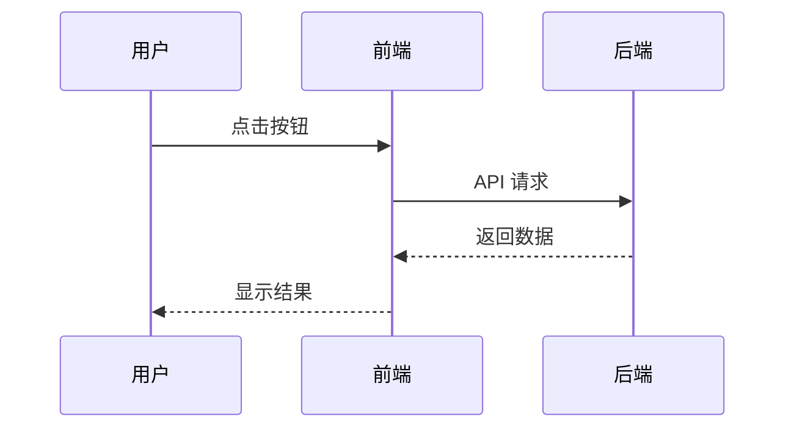
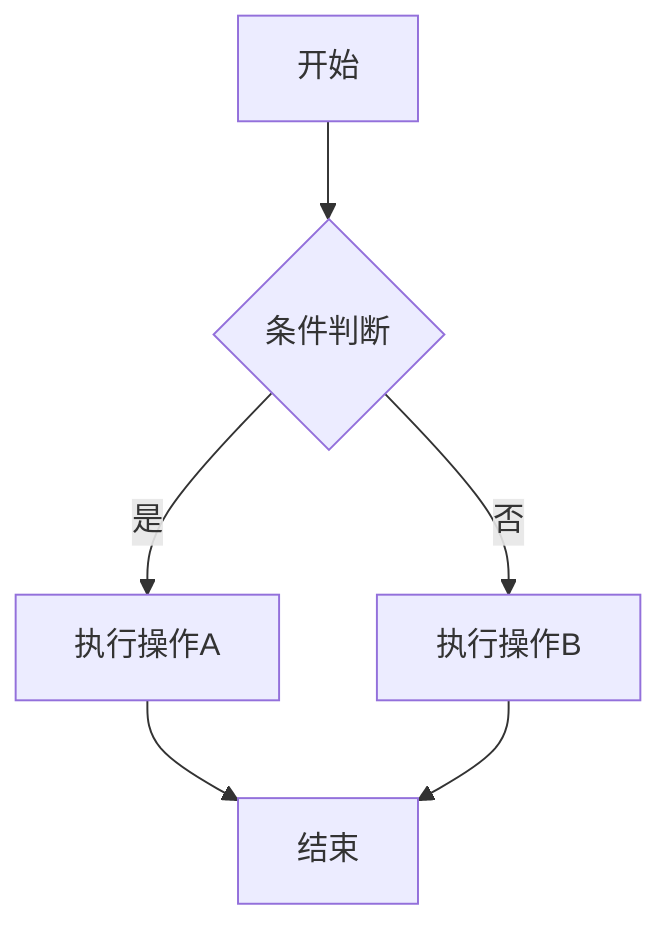
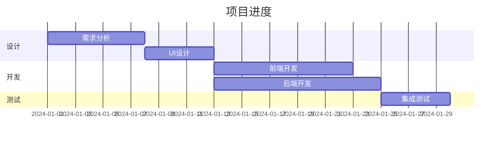
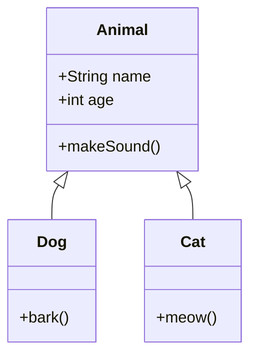
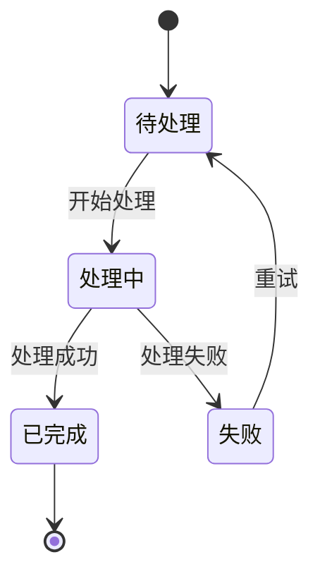
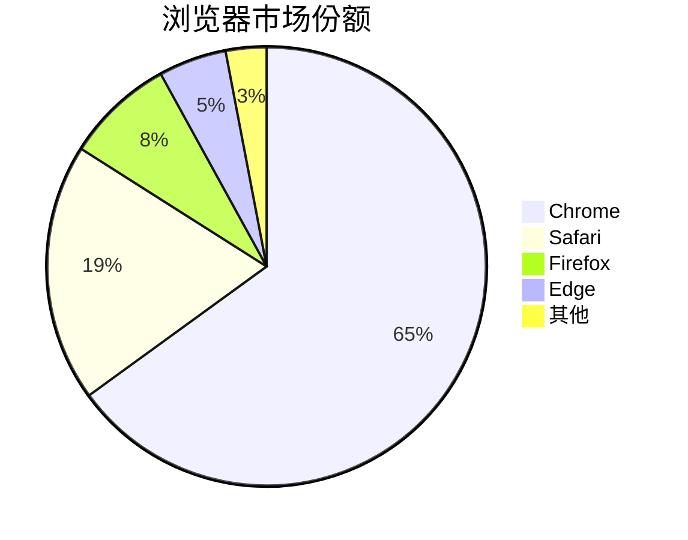
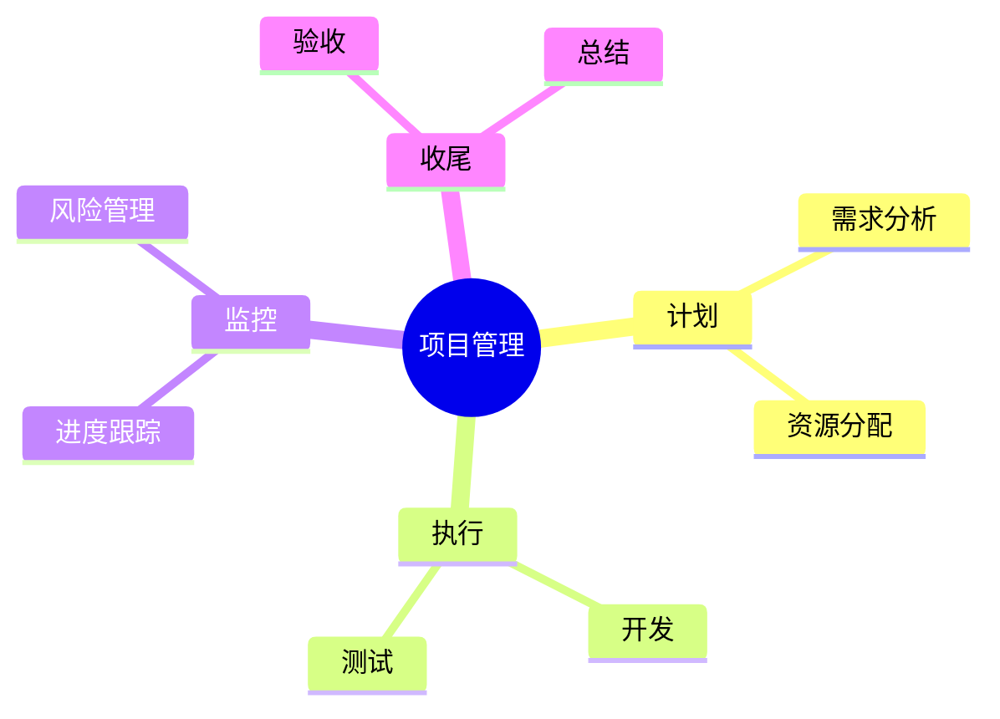
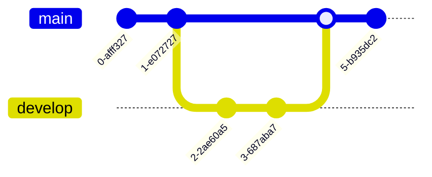
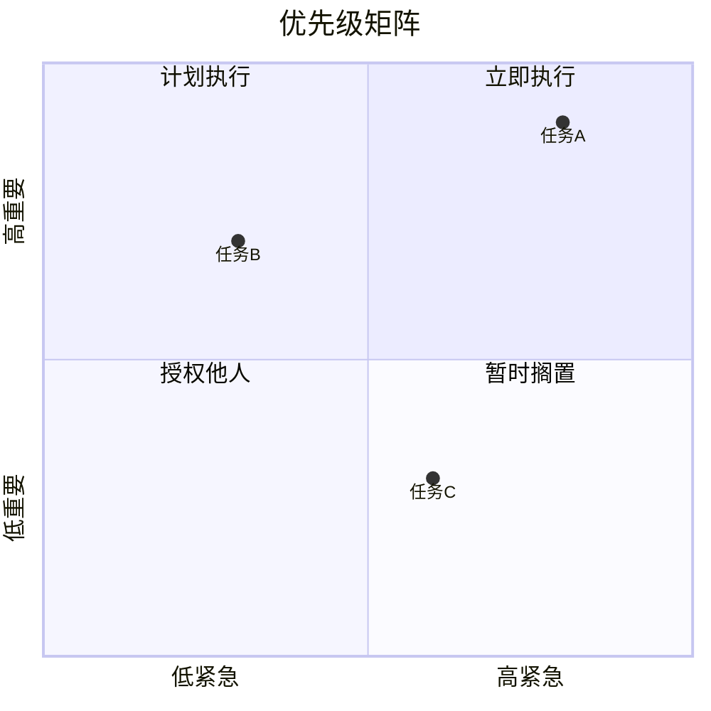

# LanisMD Mermaid 图表支持 - 技术实现方案

## 一、需求总结

| 维度 | 需求 |
|------|------|
| **渲染方式** | 实时渲染，`mermaid` 代码块自动转为图形 |
| **图表语法** | Mermaid（v11.13.0，项目已安装） |
| **编辑触发** | 悬浮工具栏点击"编辑" 或 双击图表 |
| **退出编辑** | 焦点离开自动渲染 / 点击"预览"按钮 / 按 Esc 键 |
| **工具栏功能** | 编辑/预览切换、导出 PNG、导出 SVG |
| **主题支持** | 跟随编辑器深色/浅色模式自动切换 |
| **错误处理** | 语法错误时保持代码块状态，不渲染 |

---

## 二、图表类型优先级

### P0 - 核心图表（首批实现）

| 图表类型 | Mermaid 关键字 | 典型用途 |
|----------|---------------|----------|
| 序列图 | `sequenceDiagram` | 对象交互、API 调用流程 |
| 流程图 | `flowchart` / `graph` | 算法逻辑、业务流程 |
| 甘特图 | `gantt` | 项目进度、任务排期 |
| 类图 | `classDiagram` | UML 类关系、数据模型 |
| 状态图 | `stateDiagram-v2` | 状态机、生命周期 |
| 饼图 | `pie` | 数据占比分析 |

### P1 - 扩展图表（二期实现）

| 图表类型 | Mermaid 关键字 | 典型用途 |
|----------|---------------|----------|
| 实体关系图 | `erDiagram` | 数据库设计 |
| 用户旅程图 | `journey` | 用户体验分析 |
| Git 图 | `gitGraph` | 分支管理可视化 |
| 思维导图 | `mindmap` | 知识结构、头脑风暴 |
| 时间线 | `timeline` | 历史事件、版本记录 |

### P2 - 高级图表（三期实现）

| 图表类型 | Mermaid 关键字 | 典型用途 |
|----------|---------------|----------|
| 象限图 | `quadrantChart` | 优先级矩阵、SWOT 分析 |
| 需求图 | `requirementDiagram` | 需求追踪 |
| C4 架构图 | `C4Context` 等 | 系统架构设计 |
| 桑基图 | `sankey-beta` | 流量分析、能量流向 |
| XY 图表 | `xychart-beta` | 数据可视化 |
| ZenUML | `zenuml` | 时序图（替代语法） |
| 框图 | `block-beta` | 系统框图 |
| 数据包图 | `packet-beta` | 网络协议分析 |
| 架构图 | `architecture-beta` | 云架构图 |
| 看板图 | `kanban` | 任务看板 |

> **说明**：Mermaid 引擎统一处理所有图表类型，基础渲染框架完成后所有类型自动支持。优先级主要影响**测试验证**和**文档示例**的顺序。

---

## 三、架构设计

### 3.1 目录结构

```
src/editor/plugins/mermaid-block/
├── index.ts              # 插件入口，注册 ProseMirror 插件
├── types.ts              # 类型定义
├── node-view.ts          # ProseMirror NodeView（核心状态管理）
├── renderer.ts           # Mermaid 渲染逻辑
├── toolbar.ts            # 悬浮工具栏组件
├── theme.ts              # 主题配置与切换
└── export.ts             # 导出 PNG/SVG 功能

src/styles/editor/mermaid-block.css  # 样式文件
```

### 3.2 模块职责

```
┌─────────────────────────────────────────────────────────────────┐
│                         index.ts                                │
│                      （插件入口）                                │
│  - 注册 ProseMirror Plugin                                      │
│  - 拦截 language="mermaid" 的代码块                              │
│  - 创建自定义 NodeView                                          │
└─────────────────────────────────────────────────────────────────┘
                              │
                              ▼
┌─────────────────────────────────────────────────────────────────┐
│                       node-view.ts                              │
│                   （NodeView 核心）                              │
│  - 管理 编辑/预览 两种状态                                       │
│  - 处理焦点事件（blur -> 自动渲染）                              │
│  - 处理键盘事件（Esc -> 取消编辑）                               │
│  - 处理双击事件（触发编辑）                                      │
│  - 协调 renderer / toolbar / export 模块                        │
└─────────────────────────────────────────────────────────────────┘
          │                    │                    │
          ▼                    ▼                    ▼
┌─────────────────┐  ┌─────────────────┐  ┌─────────────────┐
│  renderer.ts    │  │   toolbar.ts    │  │   export.ts     │
│ （渲染引擎）     │  │ （悬浮工具栏）   │  │ （导出功能）     │
│                 │  │                 │  │                 │
│ - mermaid.render│  │ - 编辑/预览按钮  │  │ - exportAsPng() │
│ - 错误处理      │  │ - PNG/SVG 按钮   │  │ - exportAsSvg() │
│ - 缓存机制      │  │ - 事件绑定       │  │ - Tauri 文件API │
└─────────────────┘  └─────────────────┘  └─────────────────┘
          │
          ▼
┌─────────────────┐
│   theme.ts      │
│ （主题管理）     │
│                 │
│ - 监听主题变化   │
│ - 重新初始化     │
│   Mermaid 配置  │
└─────────────────┘
```

---

## 四、核心流程

### 4.1 渲染流程

```
用户输入 ```mermaid + 代码 + ```
                │
                ▼
Milkdown 解析为 code_block 节点
attrs: { language: "mermaid" }
                │
                ▼
Plugin 拦截，创建 MermaidNodeView
                │
                ▼
调用 renderer.render(code, container)
                │
        ┌───────┴───────┐
        ▼               ▼
    渲染成功         渲染失败
        │               │
        ▼               ▼
显示 SVG 图表     保持代码块状态
+ 悬浮工具栏    （CodeMirror 编辑器）
```

### 4.2 编辑交互流程

```
【预览状态】
┌──────────────────────────────────────────┐
│  ┌────────────────────────────────────┐  │
│  │      [编辑] [PNG] [SVG]            │  │ <- hover 显示
│  └────────────────────────────────────┘  │
│                                          │
│           ╔═══════════════╗             │
│           ║   图表 SVG    ║             │ <- 双击可编辑
│           ╚═══════════════╝             │
│                                          │
└──────────────────────────────────────────┘

触发编辑：
- 点击 [编辑] 按钮
- 双击图表区域
                │
                ▼

【编辑状态】
┌──────────────────────────────────────────┐
│  ┌────────────────────────────────────┐  │
│  │      [预览] [PNG] [SVG]            │  │ <- 按钮文字变化
│  └────────────────────────────────────┘  │
│                                          │
│   ```mermaid                             │
│   sequenceDiagram                        │ <- CodeMirror
│       A->>B: Hello                       │
│   ```                                    │
│                                          │
└──────────────────────────────────────────┘

退出编辑：
┌─────────────────┬───────────────────────────────┐
│ 触发方式         │ 行为                          │
├─────────────────┼───────────────────────────────┤
│ 焦点离开 (blur)  │ 自动尝试渲染                   │
│ 点击 [预览]      │ 手动触发渲染                   │
│ 按 Esc 键        │ 取消编辑，恢复上次成功的图表    │
└─────────────────┴───────────────────────────────┘
                │
                ▼
渲染成功 -> 切换到预览状态
渲染失败 -> 保持编辑状态（不强制切换）
```

---

## 五、关键实现要点

### 5.1 类型定义 (`types.ts`)

- `MermaidBlockState`: 'preview' | 'editing'
- `MermaidRenderResult`: { success, svg?, error? }
- `ToolbarButton`: { id, icon, tooltip, onClick }
- `ExportOptions`: { format, scale?, filename? }

### 5.2 渲染器 (`renderer.ts`)

**核心功能**：
- `initMermaid(isDark)`: 初始化 Mermaid 配置，根据主题设置颜色变量
- `renderMermaid(code)`: 异步渲染，返回 SVG 或错误信息
- 内置渲染缓存（code hash -> svg），避免重复渲染
- 缓存上限 100 条，LRU 淘汰

**Mermaid 初始化配置**：
- `startOnLoad: false`
- `theme`: 根据深色/浅色模式切换
- `securityLevel: 'loose'`
- `themeVariables`: 使用项目 CSS 变量

### 5.3 NodeView (`node-view.ts`)

**核心职责**：
- 管理 DOM 结构：toolbar + previewContainer + editorContainer
- 状态切换：preview <-> editing
- 事件处理：
  - `dblclick`: 进入编辑模式
  - `focusout`: 自动尝试渲染
  - `keydown Esc`: 取消编辑，恢复上次成功的渲染
  - `mouseenter/mouseleave`: 工具栏显隐

**状态管理**：
- `lastSuccessfulSvg`: 缓存上次成功渲染的 SVG，用于 Esc 恢复

### 5.4 工具栏 (`toolbar.ts`)

**按钮配置**：
| 状态 | 按钮 | 功能 |
|------|------|------|
| 预览 | 编辑 | 切换到编辑模式 |
| 编辑 | 预览 | 手动触发渲染 |
| 通用 | PNG | 导出为 PNG 图片 |
| 通用 | SVG | 导出为 SVG 文件 |

**交互细节**：
- 预览状态：hover 时显示工具栏，离开时隐藏
- 编辑状态：工具栏始终显示

### 5.5 导出功能 (`export.ts`)

**PNG 导出**：
1. 获取 SVG 尺寸
2. 创建 Canvas（2x 分辨率）
3. 绘制白色背景 + SVG 图像
4. `canvas.toDataURL('image/png')`
5. 调用 Tauri `@tauri-apps/plugin-dialog` 选择保存路径
6. 调用 Tauri `@tauri-apps/plugin-fs` 写入文件

**SVG 导出**：
1. `XMLSerializer().serializeToString(svgElement)`
2. 添加 XML 声明头
3. 调用 Tauri API 保存

### 5.6 主题管理 (`theme.ts`)

**实现方式**：
- 使用 `MutationObserver` 监听 `document.documentElement` 的 `class` 属性变化
- 检测 `.dark` 类的存在/移除
- 主题变化时：
  1. 重新调用 `initMermaid(isDark)`
  2. 清除渲染缓存
  3. 通知所有 NodeView 重新渲染

---

## 六、样式设计要点

**类名前缀**：`.lanismd-mermaid-`

**主要样式类**：
- `.lanismd-mermaid-block`: 容器，relative 定位
- `.lanismd-mermaid-block.is-preview`: 预览状态
- `.lanismd-mermaid-block.is-editing`: 编辑状态
- `.lanismd-mermaid-toolbar`: 悬浮工具栏，absolute 定位于右上角
- `.lanismd-mermaid-toolbar.is-visible`: 工具栏可见
- `.lanismd-mermaid-toolbar-btn`: 工具栏按钮
- `.lanismd-mermaid-preview`: 预览容器，居中显示 SVG
- `.lanismd-mermaid-editor`: 编辑容器，包裹 CodeMirror

**CSS 变量依赖**：
- `--lanismd-bg-secondary`
- `--lanismd-border-color`
- `--lanismd-primary`
- `--lanismd-shadow-md`
- 等（已在 `variables.css` 中定义）

---

## 七、集成方式

### 7.1 注册插件

在 `editor-setup.ts` 的 plugins 数组中添加：

```typescript
import { mermaidBlockPlugin } from './plugins/mermaid-block';

const plugins = [
  // ... 其他插件
  mermaidBlockPlugin,
];
```

### 7.2 导入样式

在 `src/styles/editor/index.css` 中添加：

```css
@import './mermaid-block.css';
```

---

## 八、开发计划

| 阶段 | 内容 | 工作量 | 交付物 |
|------|------|--------|--------|
| **Phase 1** | 基础架构 + P0 图表渲染 | 1.5 天 | 能渲染 6 种 P0 图表 |
| **Phase 2** | 悬浮工具栏 + 编辑切换 | 1 天 | 完整的编辑交互 |
| **Phase 3** | 主题跟随 | 0.5 天 | 深色/浅色自动切换 |
| **Phase 4** | 导出 PNG/SVG | 0.5 天 | 导出功能可用 |
| **Phase 5** | P1 图表测试验证 | 0.5 天 | 验证 5 种 P1 图表 |
| **Phase 6** | P2 图表测试验证 | 0.5 天 | 验证 10 种 P2 图表 |
| **Phase 7** | 样式优化 + 边界情况处理 | 0.5 天 | 生产可用 |

**总计**：约 5 天

---

## 九、测试用例示例

### P0 - 序列图



### P0 - 流程图



### P0 - 甘特图



### P0 - 类图



### P0 - 状态图



### P0 - 饼图



### P1 - 思维导图



### P1 - Git 图



### P2 - 象限图



---

## 十、参考资料

- [Mermaid 官方文档](https://mermaid.js.org/)
- [Typora 图表支持](https://support.typora.io/Draw-Diagrams-With-Markdown/)
- [ProseMirror NodeView](https://prosemirror.net/docs/ref/#view.NodeView)
- [Milkdown 插件开发](https://milkdown.dev/docs/plugin/using-plugins)
